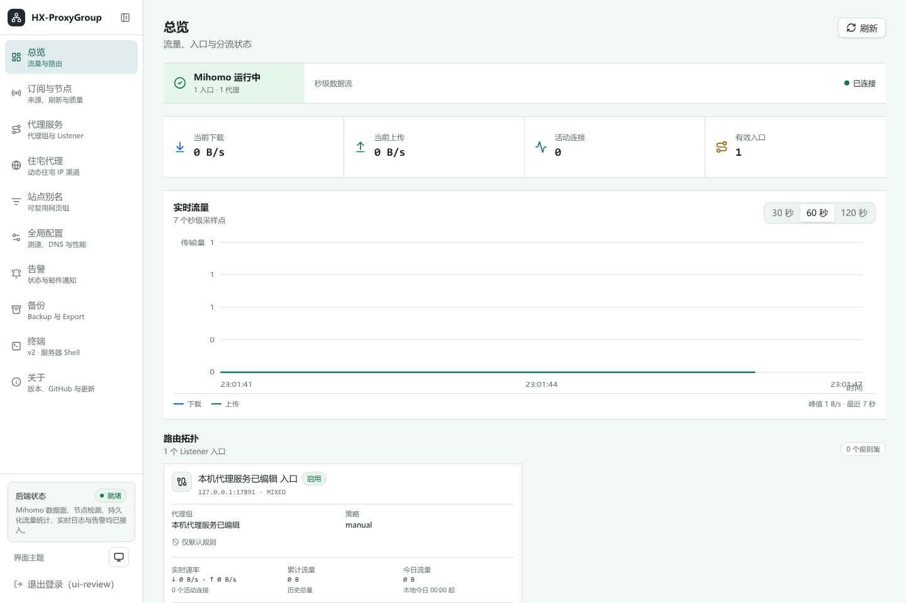
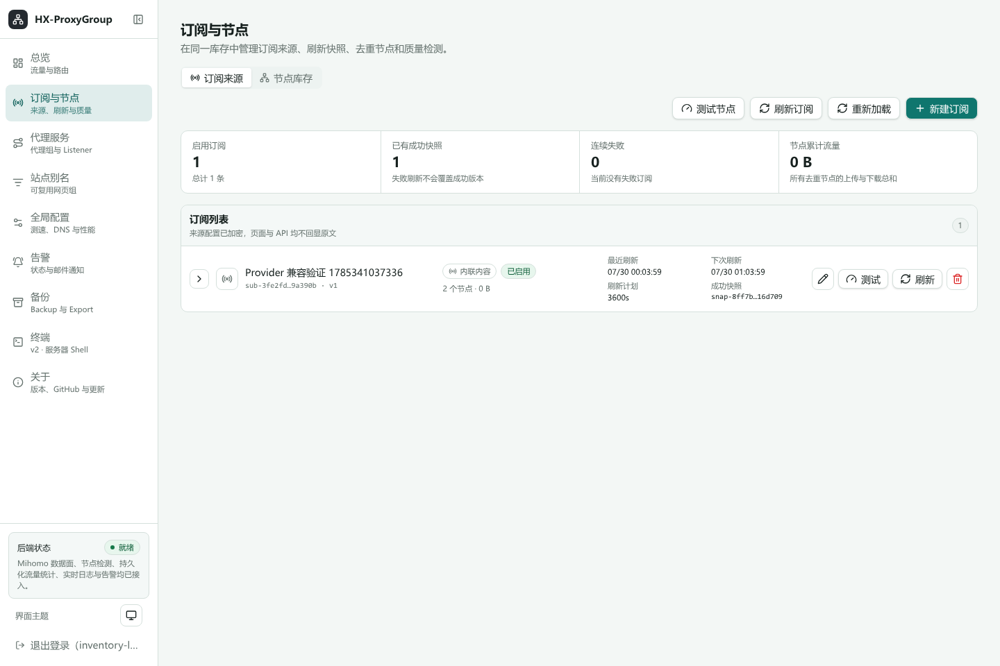
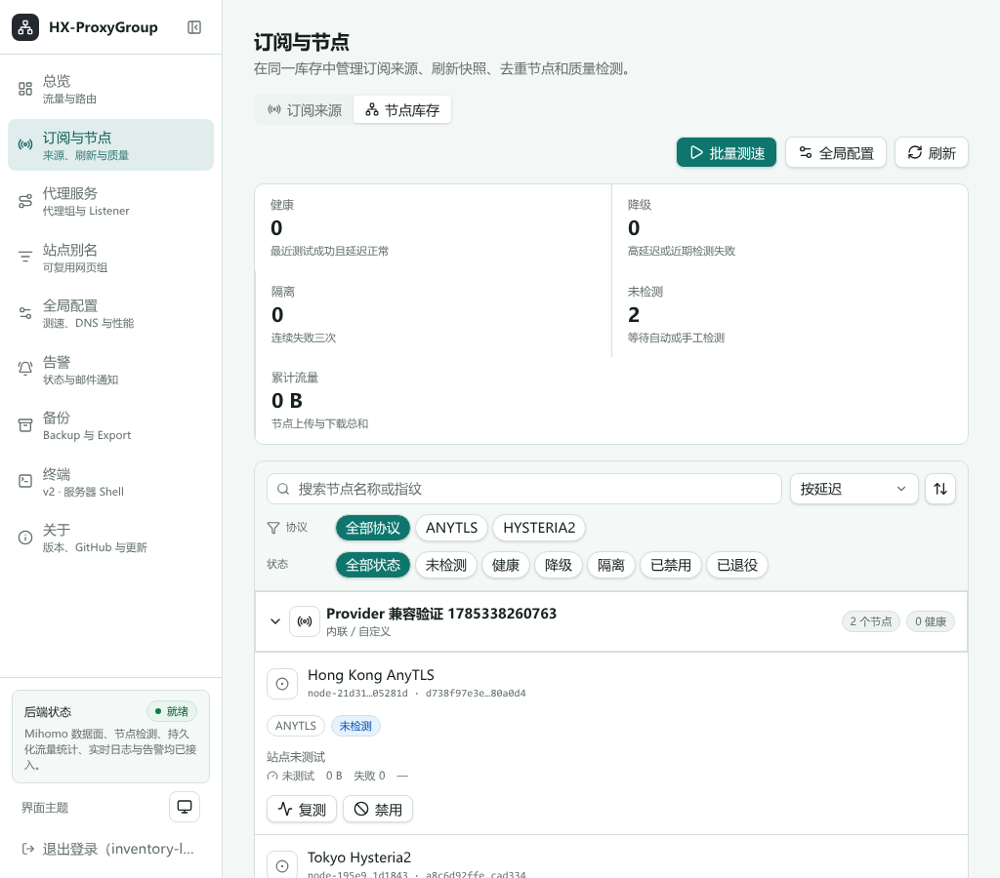
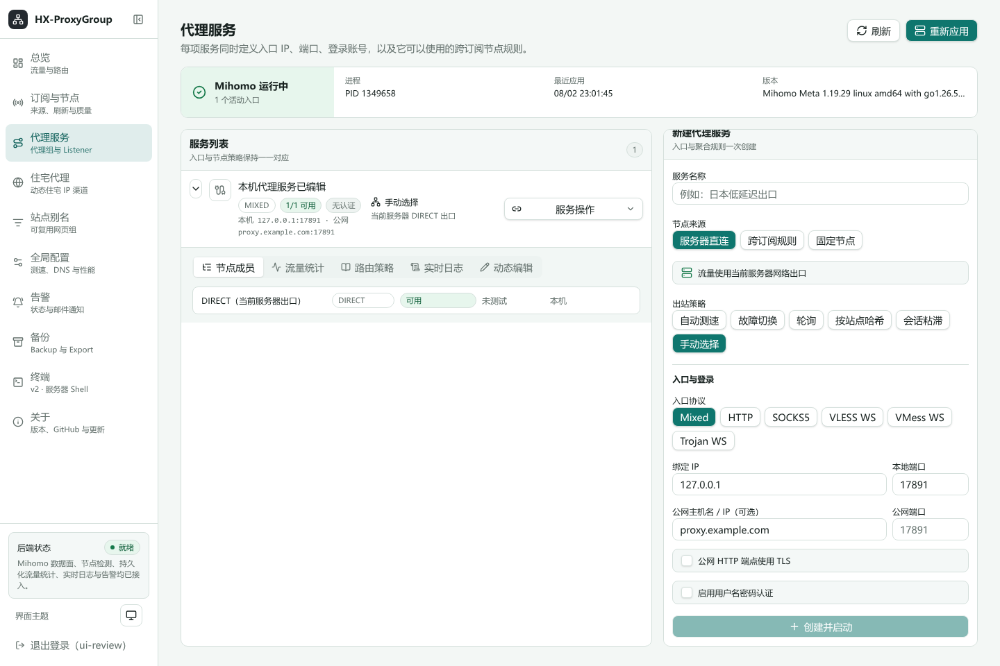
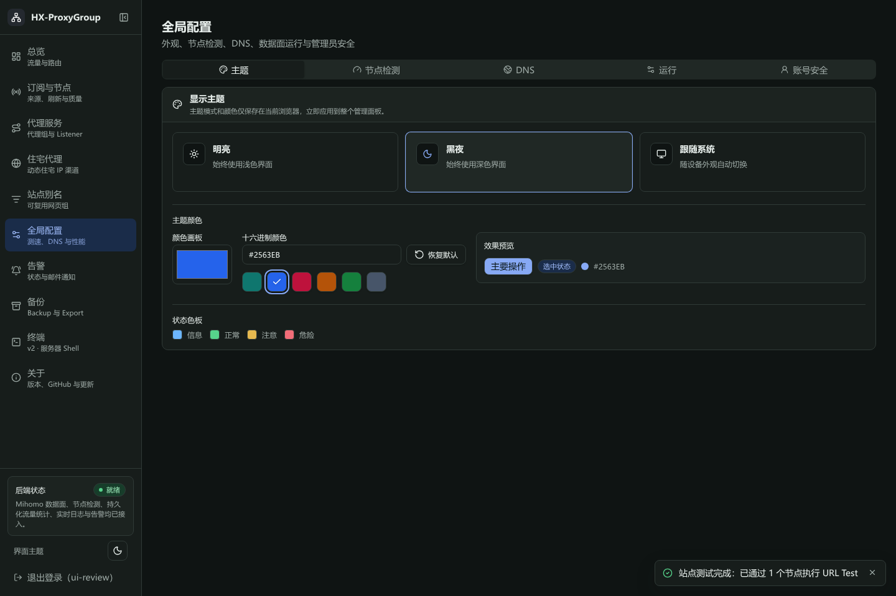
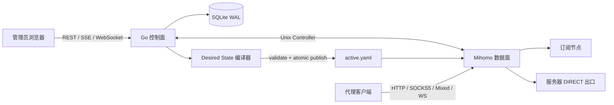

<div align="center">

<h1>HX-ProxyGroup</h1>

**面向个人 Linux 服务器的代理订阅、节点质量评估、Proxy Group 编排与多协议出口控制平面。**

让多个订阅、去重节点、质量检测、路由规则、独立 Listener、流量统计和故障恢复进入同一个可审计的管理面。

[](https://go.dev/)
[](https://react.dev/)
[](https://www.typescriptlang.org/)
[](https://github.com/MetaCubeX/mihomo)
[](https://sqlite.org/)
[](https://systemd.io/)
[](LICENSE)

[快速开始](#快速开始) · [生产安装](#生产安装) · [核心能力](#核心能力) · [架构](#架构) · [兼容性](#订阅与协议兼容性) · [文档](#文档导航)

</div>



> [!IMPORTANT]
> HX-ProxyGroup 是代理控制平面，不是新的代理协议内核。VMess、VLESS、Trojan、Hysteria、TUIC、SOCKS5、HTTP CONNECT 等数据转发由当前安装的 Mihomo 构建负责，代理流量不经过 Go 控制面。

## 为什么使用 HX-ProxyGroup

普通订阅客户端适合在单台终端上选节点；HX-ProxyGroup 面向长期运行的服务器场景，把“订阅输入”转化为可恢复、可解释、可组合的 Desired State：

| 需求 | HX-ProxyGroup 的处理方式 |
| --- | --- |
| 多个机场和自定义节点 | 统一刷新、规范化、稳定指纹去重，同时保留来源关系 |
| 节点质量不断变化 | 经 Mihomo 指定节点执行真实 HTTP 检测，支持批量复测、降级和隔离 |
| 不想手工维护静态代理组 | 按订阅、名称、地区、协议、状态、延迟、评分和 Top N 动态选取 |
| 每个业务需要独立代理端口 | 为 Proxy Group 创建 HTTP、SOCKS5 或 Mixed Listener |
| 配置失败不能影响现有代理 | 完整编译、Mihomo 校验、原子发布、热重载和上一版回滚 |
| 控制面升级时代理不能一起退出 | 控制面与 Mihomo 由两个独立 systemd unit 管理 |
| 需要知道流量和故障原因 | 秒级总览、30 天分层统计、结构化日志、告警和审计 |

## 界面

<table>
  <tr>
    <td width="50%"><strong>订阅来源</strong><br><sub>加密来源、刷新计划、快照、节点与流量集中展示。</sub></td>
    <td width="50%"><strong>节点库存</strong><br><sub>按订阅分组，支持协议/状态筛选、排序、批量检测和禁用。</sub></td>
  </tr>
  <tr>
    <td></td>
    <td></td>
  </tr>
  <tr>
    <td><strong>代理服务</strong><br><sub>组合 Proxy Group、Listener、认证、路由和客户端订阅。</sub></td>
    <td><strong>全局配置</strong><br><sub>检测、DNS、性能、主题与运行参数集中管理。</sub></td>
  </tr>
  <tr>
    <td></td>
    <td></td>
  </tr>
</table>

管理面支持明亮、黑夜、跟随系统和自定义主题色；桌面侧栏可折叠为图标模式，移动端使用紧凑顶部导航。关键页面均有 Playwright 横向溢出与响应式回归测试。

## 核心能力

### 订阅与节点库存

- Remote、Inline、File 三类订阅来源，支持固定间隔和 UTC 五字段 Cron。
- 远程请求支持自定义 Header、User-Agent、超时、条件请求与受控重定向。
- 来源配置和节点规范配置使用 AEAD 加密，API 不回显订阅 URL、Token 或节点凭据。
- 不可变成功快照、内容哈希去重和活动快照切换；刷新失败保留上一版可用节点。
- Clash/Mihomo YAML、Mihomo Provider、sing-box JSON、分享 URI 和 Base64 URI 列表。
- HTTP、File、Inline Provider 展开，带 SSRF、符号链接、深度、数量和累计体积限制。
- 稳定节点指纹、跨订阅去重、来源关系、candidate/healthy/degraded/quarantined/disabled/retired 生命周期。
- 单节点检测、批量 SSE 渐进检测、自动复测、延迟阈值、连续失败隔离和成功恢复。

### Proxy Group 与 Listener

- 一个 Proxy Group 可组合多个订阅、固定节点和本机 `DIRECT` 出口。
- 固定阶段规则流水线：

  ```text
  Normalize -> Enrich -> Predicate -> Score -> Bucket -> Sort -> Limit
  ```

- 支持 `manual`、`url-test`、`fallback`、轮询、一致性哈希和会话粘滞策略。
- 支持按订阅、名称/地区标签、协议、生命周期、延迟和评分动态筛选成员。
- HTTP CONNECT、SOCKS5 和 Mixed Listener 可直接绑定 Proxy Group。
- VLESS、VMess、Trojan over WebSocket 服务端入口由 Mihomo 提供。
- 可导出 Clash/Mihomo、v2rayN URI 列表和 sing-box 客户端订阅。
- 路由规则可将站点集合指向 `DIRECT`、`REJECT` 或指定 Proxy Group。

### 可观测性与运维

- SSE 秒级总览：上下行速率、活动连接、入口和路由拓扑。
- Listener、Proxy Group、节点维度的流量与连接统计。
- 近 24 小时一分钟、2-7 天五分钟、8-30 天一小时分层聚合。
- 订阅、空快照、空代理组和数据面异常告警，支持 SMTP、冷却、确认和恢复通知。
- SQLite Online Backup、Portable Export、SHA-256 完整性校验与敏感灾难备份。
- 可选浏览器本机 Shell：PTY + WebSocket + xterm.js，默认关闭，带并发、空闲、寿命和审计限制。

### 安全与可靠性

- 管理 API 与 Mihomo External Controller 默认只监听环回地址或 Unix Socket。
- 单管理员 Argon2id 密码、HttpOnly Session、SameSite Cookie、CSRF、登录限速和锁定。
- Remote Provider 每次 DNS 解析、重定向和连接都执行 SSRF 边界检查。
- 数据库是 Desired State 的事实来源；候选配置不通过校验就不会发布。
- 配置文件临时写入、`fsync`、原子替换；数据面重载失败自动恢复 `previous.yaml`。
- SQLite 使用 WAL、外键、busy timeout、短事务和批量统计写入。
- 所有 goroutine 都有所有者和取消路径；刷新与检测使用有界 worker pool。

## 架构



```text
systemd
├── hx-proxygroup.service              # Go 控制面、管理 API、静态前端
└── hx-proxygroup-dataplane.service    # Mihomo 数据面、真实代理转发
```

生产环境只有一个控制面进程和一个数据面进程。控制面不复制、不代理用户流量；控制面重启时，健康的数据面继续使用最后有效配置工作。

详细的模块边界、领域模型和配置事务见 [架构设计](docs/ARCHITECTURE.md)。

## 快速开始

### 环境要求

- Go 1.23 或更高版本。
- Node.js 22.12 或更高版本，仅本地前端开发需要。
- Linux 建议安装 Mihomo；没有 Mihomo 时管理面仍可启动，但代理、检测和数据面 Apply 不可用。

### 本地运行

```bash
git clone https://github.com/HengXin666/HX-ProxyGroup.git
cd HX-ProxyGroup
bash run.sh
```

`run.sh` 会在项目目录中构建控制面、启动 Vite，并在缺少依赖时根据锁文件安装前端依赖。它不要求 root、不注册 systemd，也不写入 `/usr/local`、`/etc` 或 `/var/lib`。

启动日志会打印本次随机选择的管理界面地址，例如：

```text
http://127.0.0.1:<49152-65535 之间的随机端口>
```

本地后端和前端默认分别使用不同的随机高端口；需要固定地址时可显式传入
`--listen 127.0.0.1:<port>` 和 `--frontend-port <port>`。按 `Ctrl+C` 后，
`run.sh` 会终止本次启动的后端、Mihomo、包管理器和 Vite 进程组并释放端口。

### 住宅代理（动态住宅 IP）

侧栏「住宅代理」页管理动态住宅 IP 渠道，整体模型是：

```text
供应商(厂商账号/API + TTL) -> 渠道(Listener + 客户端会话) -> 客户端
```

需要通过海外网络访问住宅网关时，可在供应商中选择一个已启用的海外
Proxy Group。实际数据面链路为：

```text
客户端 -> HX-ProxyGroup Listener -> 住宅节点 -> 上游海外 Proxy Group -> 住宅网关 -> 目标站点
```

住宅节点配置中的上游组使用稳定 ID 保存，Mihomo 编译时解析为当前组名并输出
`dialer-proxy`。上游组缺失、禁用或与住宅渠道形成循环时，配置会拒绝应用。

- **供应商**：两种接入方式。
  - 账密网关（粘滞会话）：填网关地址、子用户账号密码，用户名模板自动拼
    `账号_area-国家_life-分钟_session-会话ID`；同一会话 ID 出口 IP 不变，换 ID 即换 IP。
  - API 提取：粘贴厂商面板的完整提取链接到 `api_url`，客户端会话建立或换 IP 时
    实时请求新的 `IP:port` 节点，无需网关账号密码（BestProxy API 提取已内置预设）。
    提取链接可能包含 `app_key`，服务端使用 AEAD 加密保存，管理 API 只返回“已配置”状态。
  - 控制面 API 上游代理：可选填写 `http://`、`https://` 或 `socks5://` 代理，
    仅用于 BestProxy API 提取和服务端测试连接；它不转发客户端业务流量，地址和代理认证信息均加密保存。
- **渠道**：一个渠道 = 一个客户端入口（Listener）和客户端会话命名空间。渠道创建时
  不预取住宅 IP；透传渠道直接把流量转发给供应商网关，由供应商自行轮换。
- **客户端**：连接渠道入口（`http(s)/socks5://[账号:密码@]主机:端口`）即可使用；
  sticky 渠道支持一个 token、一个端口承载多个显式 `session_id`。客户端通过会话 API
  获取独立代理账号，此时才实时分配住宅 IP；完成高成本阶段后可按会话切到 `DIRECT`。

定制会话 API、并发容量、切流语义和安全边界见
[住宅代理客户端会话 API](docs/RESIDENTIAL_SESSION_API.md)。

每个客户端会话单独记录供应商 TTL。供应商可配置到期后终止客户端会话，或保留客户端认证并
实时换一个住宅 IP；后台维护任务也会有界处理到期会话，不依赖客户端再次调用 API。
BestProxy 的 `life` 按分钟计算，API 提取链接中的 `life` 参数优先于表单里的 TTL；通用供应商
的 `session_ttl_seconds` 按秒计算。

保存供应商后先用「测试连接」确认出口 IP 真实可用，再创建渠道。

「测试连接」是控制面的单次供应商诊断；配置了上游 Proxy Group 后，最终链路仍应从
渠道 Listener 发起一次真实 HTTPS 请求验证，因为控制面诊断不会代替 Mihomo 的
`dialer-proxy` 数据面路径。

链式住宅代理的配置顺序必须是：先导入并刷新海外订阅，再用该订阅创建一个已启用的
Proxy Group，最后在住宅供应商编辑框的「上游海外 Proxy Group」中选择它。保存后检查
`runtime/active.yaml` 中每个住宅节点是否出现 `dialer-proxy: <上游组名>`；没有该字段时，
住宅网关仍然是直连，无法满足需要通过订阅访问住宅网关的网络环境。

客户端使用渠道的 Listener 地址，不使用控制面 `19090`。`7890` 通常已被本机其他
Mihomo/Clash 占用，住宅渠道建议使用独立端口（例如 `18088`）；Listener 端口占用现在
会在数据面应用前直接报错。

首次启动会生成：

```text
.tmp/run-data/admin-setup-token
```

在初始化页面输入该一次性 Token、管理员用户名和密码即可完成登录。按 `Ctrl+C` 会统一停止本次启动的前后端进程。

常用开发参数：

```bash
bash run.sh --help
bash run.sh --mihomo /path/to/mihomo
bash run.sh --backend-only
bash run.sh --no-install-frontend-deps
```

## 生产安装

生产安装面向使用 systemd 的 Linux `amd64` / `arm64` 服务器。安装脚本会下载固定 GitHub Release、校验 SHA-256、安装控制面、Mihomo 和静态前端，再注册双服务。

> [!NOTE]
> 在线安装依赖 Release 中已上传符合 [发布包契约](scripts/package-release.sh) 的架构包与 `SHA256SUMS`。

```bash
curl -fsSLO https://raw.githubusercontent.com/HengXin666/HX-ProxyGroup/main/install.sh && sudo bash install.sh install
```

安装成功后，后续版本只需要一行命令：

```bash
sudo hx-proxygroup-install upgrade
```

安装器在切换版本前校验新 Mihomo 与当前配置；双服务 readiness 失败时原子恢复上一版 `current` 链接并重启旧版本。升级成功后安装器自身也会更新。

| 命令 | 用途 |
| --- | --- |
| `sudo hx-proxygroup-install upgrade` | 获取并升级到最新固定 Release |
| `sudo hx-proxygroup-install upgrade --version vX.Y.Z` | 安装指定版本 |
| `sudo hx-proxygroup-install status` | 查看双服务与当前版本 |
| `sudo hx-proxygroup-install repair` | 恢复目录权限、unit 和服务 |
| `sudo hx-proxygroup-install backup` | 创建包含秘密的 `0600` 灾难归档 |
| `sudo hx-proxygroup-install uninstall` | 移除服务和程序，保留数据与备份 |
| `sudo hx-proxygroup-install purge --confirm-purge` | 明确确认后删除程序和全部持久数据 |

离线安装：

```bash
sudo bash install.sh install --offline-dir /path/to/release
```

离线目录需要包含 `VERSION`、`SHA256SUMS` 和当前架构的 Release 包。

默认布局：

```text
/usr/local/lib/hx-proxygroup/
├── versions/<release>/
└── current -> versions/<release>

/etc/hx-proxygroup/                 # 最小启动配置
/var/lib/hx-proxygroup/             # SQLite、密钥、快照、运行配置、备份
/etc/systemd/system/                # 控制面与数据面 unit
```

## 订阅与协议兼容性

控制面当前可规范化的 Mihomo YAML 出站类型：

```text
AnyTLS      Hysteria     Hysteria2    HTTP         Mieru        ShadowTLS
Snell       SOCKS5       Shadowsocks  SSH          ShadowsocksR  Trojan
TUIC        VLESS        VMess         WireGuard
```

分享 URI 覆盖 VLESS、VMess、Trojan、Shadowsocks、HTTP(S)、SOCKS5、Hysteria、Hysteria2/Hy2、TUIC、AnyTLS 和 SSH。

“可解析”不等于数据面一定支持：最终能力取决于关于页显示的 Mihomo 版本，并由每次候选配置的 `mihomo -t` 决定。项目不承诺未知协议或所有机场私有变体自动兼容。

完整容器、Provider、sing-box 映射和 URI 矩阵见 [订阅与 Provider 兼容矩阵](docs/SUBSCRIPTION_COMPATIBILITY.md)。

## 基准、占用与恢复验证

测试环境：Linux amd64、Go `1.26.5-X:nodwarf5`、Intel Core i9-13980HX、32 逻辑 CPU。下列数据为三次运行的中间值：

| 场景 | 中间值 | 累计分配 |
| --- | ---: | ---: |
| 解析 10,000 个 Mihomo 节点 | 87.82 ms | 59.2 MB/op |
| 编译 10,000 个节点的完整配置 | 105.65 ms | 234.2 MB/op |
| SQLite 批量写入 1,000 个统计资源 | 33.80 ms | 1.04 MB/op |
| SQLite 查询 500 个统计点 | 1.30 ms | 0.13 MB/op |

同一环境下的生产构建空闲基线（2026-07-30，连续 15 秒低活动采样）：

| 进程 / 资源 | 实测值 | 说明 |
| --- | ---: | --- |
| Go 控制面 RSS | 19.9 MiB | 空数据库、静态前端、终端关闭 |
| Mihomo RSS | 43.1 MiB | v1.19.29、1 个仅环回 DIRECT Mixed Listener |
| 双进程合计 RSS | 63.0 MiB | 两个进程同时空闲时的 RSS 合计 |
| 空闲 CPU | 0 tick / 15 秒 | 两个进程分别采样；本机测量分辨率约 0.07% 单核 |
| 程序与前端 | 59.4 MiB | 控制面 12.5 MiB + Mihomo 46.1 MiB + Web 0.85 MiB |

这是开发机上的空闲实测值，不是所有 VPS 的上限或保证值。订阅刷新、10,000 节点解析、配置编译、连接统计和 Mihomo 实际转发都会产生瞬时 CPU 与内存峰值；版本保留、SQLite、快照和日志也会增加磁盘占用。轻量生产部署建议至少准备 **512 MiB RAM**，大量节点或连接建议 **1 GiB 及以上**；256 MiB 只适合经实测确认的极轻负载。

自动化故障测试覆盖：

- 辅助进程在 SQLite 未提交写事务中被强制终止，重开后恢复最后已提交状态并通过完整性检查。
- 外部 Mihomo 热重载失败后恢复上一版配置并再次加载。
- 关闭控制面 Manager 不终止 systemd 所有的数据面。
- Release 包内容、可复现 SHA-256、双 unit 私有监听和安装契约。

这些是控制面微基准与空闲资源基线，不代表 HTTP CONNECT/SOCKS5 的真实吞吐或高峰占用。真实并发连接、整机断电、磁盘满和干净发行版 VM 安装仍需环境测试。命令、三次原始结果和边界见 [基准与故障恢复报告](docs/BENCHMARKS.md)。

## 运维说明

### 与宿主机 TUN 共存

受管 Mihomo 默认从 Linux 主路由表识别物理出口，并写入 `interface-name`，避免上游拨号再次进入 Clash Verge、Mihomo Party 等宿主机 TUN。

```bash
# 显式指定物理出口
HX_PROXYGROUP_MIHOMO_EGRESS_INTERFACE=eth0 bash run.sh

# 明确允许数据面跟随宿主机策略路由
HX_PROXYGROUP_MIHOMO_EGRESS_INTERFACE=off bash run.sh
```

默认 `GOMAXPROCS` 最多为 4，Mihomo 日志单文件上限 8 MiB、保留 2 份。可通过 `HX_PROXYGROUP_MIHOMO_MAX_PROCS`、`HX_PROXYGROUP_MIHOMO_LOG_MAX_BYTES` 和 `HX_PROXYGROUP_MIHOMO_LOG_BACKUPS` 调整。

### 浏览器终端

浏览器本机 Shell 属于可选 v2 能力，默认关闭：

```bash
HX_PROXYGROUP_TERMINAL=1 bash run.sh
```

终端要求管理员登录，默认空闲 10 分钟断开、最长 2 小时、最多 2 个并发会话，并记录建立、关闭、来源、操作者、时长和原因。它不是远程 SSH 跳板。

这是 HX-ProxyGroup 所在服务器的本机 PTY Shell。普通命令行模式下，前端读取服务端 PTY 的 `ECHO` / `ICANON` 状态，只对可打印字符做有界预测回显，因此网络较慢时键入内容仍会立即出现在本地；真实命令结果仍取决于网络和服务器响应。密码提示、控制键、未知状态及 vim/top 等 raw/full-screen 程序不会预测回显。

WebSocket 只接受同源连接，并在会话存续期间周期性复核数据库中的管理员 Session；退出全部会话、修改账号或密码、Session 过期都会关闭已连接终端。Shell 只继承必要的身份、路径与区域环境，控制面配置和凭据不会注入终端。启用此功能仍等价于向管理员授予 `hx-proxygroup` 服务账号的命令执行权限，日常运维应优先使用带密钥和系统级审计的 SSH。完整威胁模型与漏洞报告方式见 [安全策略](SECURITY.md)。

### 备份语义

- 管理面的普通 Backup 使用 SQLite Online Backup，适合同实例恢复，不包含主密钥和完整敏感运行状态。
- `hx-proxygroup-install backup` 会短暂停止控制面，归档配置、数据库、主密钥、运行配置和快照；归档包含秘密。
- Portable Export 默认不导出秘密，用于跨实例迁移配置。
- 自动 Restore 和加密 Backup Wrapper 仍在后续清单。

## 开发与测试

```bash
# 后端
go test ./...
go vet ./...

# 前端
cd web
npm ci
npm run check
npm run build
```

前端关键链路使用 Playwright 验证桌面、窄桌面和移动端布局，包含页面横向溢出、筛选按钮相交、侧栏折叠宽度和 Tooltip 可见性断言。运行截图保存在 [`docs/screenshots/`](docs/screenshots/)。

代码修改应遵守 [AGENTS.md](AGENTS.md) 中的模块边界、并发、安全、测试和本地进程生命周期要求。

## 文档导航

| 文档 | 内容 |
| --- | --- |
| [v1 核心清单](docs/V1_CORE.md) | 功能范围、验收标准、完成状态和剩余工作 |
| [架构设计](docs/ARCHITECTURE.md) | 控制面/数据面、领域模型、配置事务和模块边界 |
| [可靠性与部署](docs/RELIABILITY.md) | systemd、安装、升级、回滚、安全和资源保护 |
| [订阅管理](docs/SUBSCRIPTIONS.md) | 加密来源、刷新、快照、调度和 SSRF |
| [兼容矩阵](docs/SUBSCRIPTION_COMPATIBILITY.md) | Provider、Mihomo、sing-box 和分享 URI |
| [基准与故障恢复](docs/BENCHMARKS.md) | 环境、命令、结果、恢复测试和未测边界 |
| [探测、路由与总览](docs/PROBES_ROUTING_OVERVIEW.md) | 节点检测、路由规则与 SSE 总览 |
| [流量统计](docs/TRAFFIC_STATS.md) | 聚合粒度、查询、保留策略和精度边界 |
| [Cloudflare / 雷池](docs/CLOUDFLARE.md) | WebSocket 入口、反向代理和公网边界 |
| [备份与导出](docs/BACKUP_EXPORT.md) | Artifact、Online Backup 与秘密处理 |
| [v2 能力](docs/V2.md) | 规则流水线、认证、告警、调度与浏览器终端 |
| [安全策略](SECURITY.md) | 漏洞报告、部署边界与浏览器终端威胁模型 |

## 当前状态与路线

已经形成可运行纵向闭环：

```text
添加订阅 -> 刷新/展开 Provider -> 节点去重 -> 质量检测
-> 动态 Proxy Group -> Listener -> Mihomo Apply -> 流量与告警
```

仍在推进：

- 真实 HTTP CONNECT、SOCKS5 和高并发数据面性能报告。
- 干净 Debian/Ubuntu VM 的安装、升级、整机重启和断电演练。
- 自动 Restore、加密灾难备份和 Portable Import。
- 更多服务端入口、完整资源监控与系统诊断整合页。
- OpenAPI、CI 发布流水线、签名校验和发行版维护流程。

项目进度以 [`docs/V1_CORE.md`](docs/V1_CORE.md) 为准，不以 README 的概括替代验收清单。

## 项目边界

HX-ProxyGroup 明确不做：

- 自行实现 VMess、VLESS、Trojan、Hysteria、TUIC、SOCKS5 或 HTTP CONNECT 转发。
- 让 Go 控制面进入实际代理流量路径。
- 将 WebSocket Path 当作认证。
- 默认公开管理 API、External Controller 或新 Listener。
- 承诺“支持所有协议”或所有未知订阅变体。
- 在 v1 引入 MySQL、Redis、Kafka、etcd 或独立任务队列。

## 参与贡献

提交 Issue 或 Pull Request 前，请先阅读 [AGENTS.md](AGENTS.md) 和对应领域文档：

1. 描述要解决的用户问题、行为边界和兼容性影响。
2. 订阅样本必须脱敏，不提交真实 URL、Token、密码、私钥或数据库。
3. 保持 `api -> application service -> domain/interface -> repository/dataplane` 边界。
4. 新行为需要单元测试；涉及 SQLite、HTTP、Mihomo 或前端主链路时增加集成/E2E 测试。
5. 提交前运行格式化、`go test ./...`、`go vet ./...` 和前端构建。

## 许可

HX-ProxyGroup 自有代码采用 [MIT License](LICENSE)。Mihomo 由其上游独立发布，依赖项和随 Release 分发的第三方组件继续适用各自的许可证；MIT License 不会覆盖或替代这些上游条款。

---

<div align="center">

HX-ProxyGroup · 一个控制面，一个数据面，配置可解释，失败可恢复。

</div>
