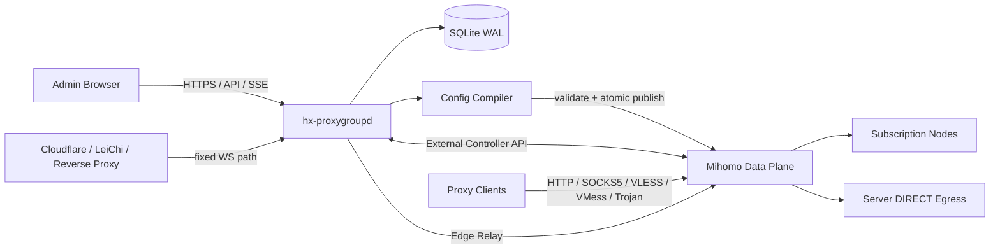
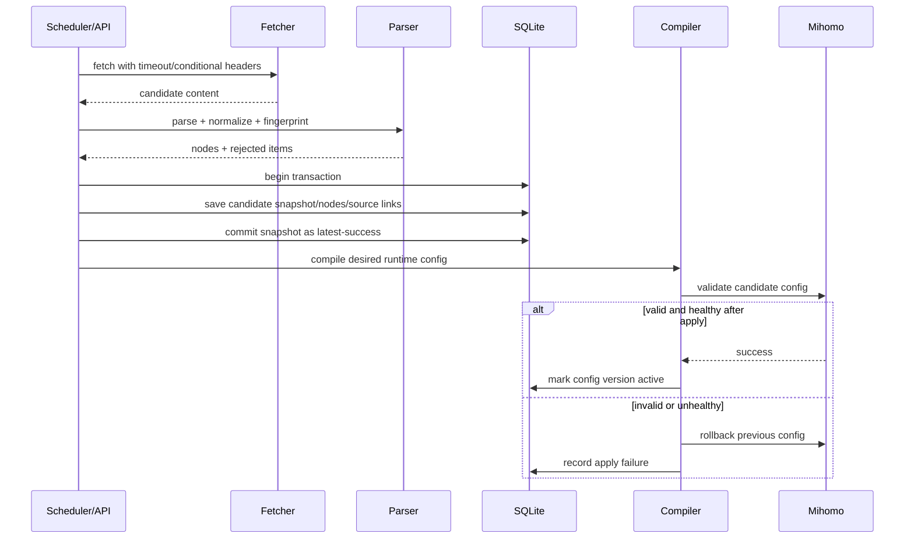

# HX-ProxyGroup 架构设计

## 1. 架构结论

HX-ProxyGroup 使用**控制面 / 数据面分离**：

- **控制面 `hx-proxygroupd`**：Go 单体服务，负责订阅、规则、调度、统计、告警、管理 API、配置编译和数据面监督；可选的 Edge Relay 只转发固定 WebSocket 路由。
- **数据面 `mihomo`**：负责全部代理协议、Listener、Proxy Provider、Proxy Group、连接转发和实时流量数据。
- **前端 `web`**：React 构建为静态资源，由控制面直接提供。
- **存储 `SQLite`**：保存配置、快照、任务状态、统计聚合、告警和审计数据。



关键约束：**协议处理和目标连接建立始终属于 Mihomo 数据面。** 普通入口不经过控制面；为兼容
Cloudflare / 雷池单上游拓扑，控制面只在固定 `/__hx-proxy__/` 命名空间内提供受限 WebSocket
Edge Relay，转发已经升级的连接，不解析 VLESS、VMess 或 Trojan，不接受任意目标地址。控制面退出
时，直接监听的数据面仍应继续使用最后一版有效配置提供代理；Edge Relay 的新连接需等待控制面恢复。

---

## 2. 为什么 v1 选择 Mihomo 数据面

v1 需求与 Mihomo 的原生抽象高度一致：

- Proxy Provider 对应远程订阅和周期刷新。
- Proxy Group 对应 URL Test、Fallback、Load Balance、Consistent Hashing 和 Sticky Sessions。
- Listener 可以将独立入站直接绑定到指定代理组。
- 支持 HTTP、SOCKS5、Mixed，以及 VLESS、VMess、Trojan 等服务端 Listener。
- External Controller API 可提供节点、连接、流量和策略状态。

因此，v1 不在 Go 控制面中重新实现 HTTP CONNECT、SOCKS5、VMess、VLESS 等数据转发逻辑。

`easy-proxies` 使用 sing-box，是重要参考，但 HX-ProxyGroup 的需求更强调多代理组、负载均衡、会话粘滞和独立 Listener。架构中仍保留 `DataPlane` 抽象，未来可以实现 `SingBoxAdapter`，但 v1 只维护一个 Mihomo 实现，避免双内核带来的测试和运维成本。

---

## 3. 进程与部署模型

```text
systemd
├── hx-proxygroup.service
│   └── /usr/local/lib/hx-proxygroup/current/hx-proxygroupd --mihomo-external
├── hx-proxygroup-dataplane.service
│   └── /usr/local/lib/hx-proxygroup/current/mihomo -f /var/lib/hx-proxygroup/runtime/active.yaml
└── hx-proxygroup-terminal.service
    └── /usr/local/lib/hx-proxygroup/current/hx-proxygroupd --terminal-helper
```

建议目录：

```text
/etc/hx-proxygroup/
├── config.yaml                 # 控制面最小启动配置
├── secrets.env                # 可选，0600
└── certificates/              # 可选服务端证书

/var/lib/hx-proxygroup/
├── hx-proxygroup.db
├── runtime/
│   ├── active.yaml             # 当前生效数据面配置
│   ├── previous.yaml           # 上一版有效配置
│   ├── candidates/             # 待校验配置
│   └── providers/              # 数据面 provider 缓存
├── snapshots/                 # 订阅成功快照
└── backups/

/usr/local/lib/hx-proxygroup/
├── versions/<release>/        # 控制面、Mihomo、静态前端与 unit
└── current -> versions/<release>

/var/log/hx-proxygroup/
└── audit.log                   # 可选；默认优先 journald
```

控制面和数据面使用同一不可登录系统用户运行。systemd 分别拥有控制面、数据面和终端 helper 三个进程；控制面只通过 Unix Controller 校验和热重载数据面配置，退出时不终止外部 Mihomo。终端 helper 是唯一的 root 进程，只提供控制面用户可访问的本机 PTY Unix Socket，不承载代理流量；控制面本身继续使用 systemd 文件、设备和 capability 沙箱。

---

## 4. 后端模块边界

建议初始目录：

```text
cmd/
├── hx-proxygroupd/             # 服务入口
└── hx-proxygroupctl/           # 初始化、诊断、备份、恢复 CLI

internal/
├── app/                        # 生命周期和依赖装配
├── api/                        # HTTP API、SSE、认证中间件
├── auth/                       # 管理员、Session、密码哈希
├── subscription/               # 拉取、快照、解析入口
├── node/                       # 节点领域模型、指纹、生命周期
├── pipeline/                   # Enrich / Predicate / Score / Sort
├── group/                      # 代理组、依赖图、策略编译
├── listener/                   # 入站端口和认证配置
├── dataplane/
│   ├── contract.go             # DataPlane 接口
│   └── mihomo/                 # Mihomo 配置和 API 适配
├── compiler/                   # 完整配置快照编译
├── scheduler/                  # 刷新、探测、清理和备份任务
├── probe/                      # TCP、HTTP、速度、Geo、IP 质量
├── metrics/                    # 实时采集、窗口聚合、查询
├── alert/                      # 告警状态机和邮件通道
├── audit/                      # 管理操作审计
├── store/                      # SQLite repository 与迁移
├── backup/                     # 在线备份和恢复验证
├── system/                     # 资源、磁盘、版本和进程状态
└── web/                        # 嵌入式前端静态资源
```

依赖方向：

```text
api -> application service -> domain -> repository/interface
                           -> dataplane interface
                           -> scheduler interface
```

禁止：

- API handler 直接执行 SQL。
- 前端请求直接代理到 Mihomo External Controller。
- 领域层直接依赖 Mihomo YAML 结构。
- 数据库模型直接作为公开 API DTO。
- 探测器直接修改代理组配置。

---

## 5. DataPlane 抽象

v1 只实现 Mihomo，但接口必须避免业务逻辑与 Mihomo 配置结构耦合。

```go
type DataPlane interface {
    Capabilities(ctx context.Context) (Capabilities, error)
    Validate(ctx context.Context, candidate ConfigArtifact) error
    Apply(ctx context.Context, candidate ConfigArtifact) (ApplyResult, error)
    Rollback(ctx context.Context, version ConfigVersion) error
    Health(ctx context.Context) (HealthStatus, error)
    Snapshot(ctx context.Context) (RuntimeSnapshot, error)
    TestNode(ctx context.Context, nodeID NodeID, probe ProbeRequest) (ProbeResult, error)
    StreamTraffic(ctx context.Context) (<-chan TrafficSample, error)
}
```

`Capabilities` 至少包含：

- 支持的出站协议。
- 支持的 Listener 类型与传输层。
- 支持的代理组策略。
- 是否支持热重载。
- 是否支持按节点测速、连接查询和流量统计。

控制面保存逻辑能力名，例如 `sticky-sessions`，由适配器转换为具体数据面配置。

---

## 6. 领域模型

### 6.1 Subscription

```text
Subscription
├── id
├── name
├── source_type: remote | inline | file
├── source_config_encrypted
├── enabled
├── refresh_policy
├── request_policy
├── last_success_snapshot_id
├── consecutive_failures
├── version
└── timestamps
```

`source_config_encrypted` 包含 URL、Header、Token 等敏感信息。列表 API 只返回脱敏视图。

### 6.2 SubscriptionSnapshot

```text
SubscriptionSnapshot
├── id
├── subscription_id
├── content_hash
├── fetched_at
├── http_metadata
├── parse_summary
├── node_count
├── artifact_path
└── status
```

每次刷新先创建候选快照，解析、规范化和持久化全部成功后，才原子更新 `last_success_snapshot_id`。

### 6.3 Node

```text
Node
├── id
├── fingerprint
├── display_name
├── protocol
├── canonical_config_encrypted
├── lifecycle_state
├── first_seen_at
├── last_seen_at
├── retired_at
└── version
```

订阅和节点是多对多关系。节点来源变化不会删除节点本体和历史指标。

### 6.4 MetricSnapshot

```text
MetricSnapshot
├── node_id
├── tcp_latency_ms
├── http_ttfb_ms
├── http_total_ms
├── download_bps
├── upload_bps
├── exit_ip
├── country_code
├── region
├── asn
├── ip_quality
├── availability
├── sampled_at
└── expires_at
```

质量值必须带采样时间。规则不得把过期指标当作最新指标使用。

### 6.5 ProxyGroup

```text
ProxyGroup
├── id
├── name
├── source_refs[]
├── pipeline_spec
├── strategy
├── session_policy
├── empty_policy
├── enabled
├── version
└── timestamps
```

代理组保存用户意图，不直接保存最终节点列表。最终节点列表由编译器根据当前快照和指标生成。

### 6.6 Listener

```text
Listener
├── id
├── name
├── type
├── bind_address
├── port
├── proxy_group_id
├── auth_policy
├── transport
├── tls_policy
├── limits
├── public_endpoint
├── enabled
└── version
```

`public_endpoint` 描述对外域名和端口，可与实际监听地址不同，用于 Cloudflare / 雷池之后的订阅导出。

### 6.7 Proxy Service 应用聚合

管理面中的“代理服务”不是新的数据库实体，而是 `ProxyGroup + Listener` 的应用层聚合视图。创建操作先保存用户的跨订阅选择规则，再创建绑定该组的入口；入口校验或应用失败时补偿删除刚创建的组。这样用户可以在一次操作中定义入口 IP、端口、账号和可代理节点范围，同时保持领域层与 Mihomo 编译器中的 Group / Listener 边界。

当前 `source_spec` 可同时保存固定 `node_ids` 与动态选择条件：`subscription_ids`、名称地区标签、协议、生命周期、最大延迟、排序字段和数量上限。数据库只保存用户意图；Mihomo 编译器每次从活动订阅快照与最新节点质量记录重新解析成员，并稳定排序输出。地区当前来自节点展示名称标签，后续结构化 Geo Enricher 上线后应替换为带采样时间的地区字段。

### 6.8 住宅客户端会话

`residential_client_sessions` 保存一个住宅渠道下由客户端显式命名的逻辑会话、加密代理
密码、当前节点指纹、分配时间、过期时间和 `residential | upstream | direct` 路由状态。
一个渠道仍只有一个 Listener 和一个公共 token，但不保存或预建 IP 池。

sticky 渠道创建时生成显式允许为空的 fail-closed Proxy Group，其唯一成员为 `REJECT`。
客户端调用会话建立 API 后，应用服务才向供应商获取或生成一个节点，将节点直接绑定到
该逻辑会话并完整校验、发布配置。供应商的并发配置只限制活跃会话数量，不代表预取数量。

编译器将会话账号加入该 Listener 的 Mihomo `users`，并在普通站点路由规则之前生成
`IN-USER` 规则。切流属于 Desired State 变更，必须经过完整配置校验和应用；应用成功后
控制面通过 Mihomo Controller 删除该 `inboundUser` 的旧连接。流量本身始终留在 Mihomo
数据面。完整外部协议见 [住宅代理客户端会话 API](RESIDENTIAL_SESSION_API.md)。

注册后的会话可切到供应商配置的普通上游代理组，避免继续消耗住宅代理流量；物理
`DIRECT` 仍作为显式选项保留，适用于服务器自身具备公网直连能力的部署。
供应商定义会话 TTL 和 `expire | rotate` 到期策略。`expire` 删除认证、路由和节点；
`rotate` 为同一客户端认证现场分配新节点并关闭旧连接。后台任务以有界批次执行相同状态迁移。

### 6.9 住宅地区选择

供应商和渠道分别保存地区策略。策略为 `fixed` 时使用一个固定地区；策略为
`application-random` 时保存最多 64 个手动候选地区。渠道没有显式策略时继承供应商默认策略，
之后可单独覆盖。应用服务在每次分配或换 IP 前使用 `crypto/rand` 选择一个候选值：账密网关将
它渲染进用户名模板，`api-list` 提取会根据现有的 `cc`、`country`、`country_code`、`region`
或 `area` 参数改写 URL；如果随机 API URL 没有这些参数，则按 BestProxy 约定添加 `cc`。
供应商返回的节点列表不会被控制面当作地区随机性的依据。

---

## 7. 订阅刷新事务



核心规则：

1. 下载成功不等于刷新成功。
2. 解析成功不等于生效成功。
3. 只有数据库快照提交、配置校验和数据面生效检查全部完成，刷新任务才返回成功。
4. 任一步失败均保留上一版可用代理配置。

---

## 8. 配置编译器

配置编译器是纯函数优先的组件：

```text
DesiredState + CapabilitySet + RuntimeDefaults -> ConfigArtifact
```

输入：

- 当前有效订阅快照。
- 节点及最新有效指标。
- 代理组定义和规则流水线。
- Listener 定义。
- 数据面能力集合。
- 全局安全和性能默认值。

输出：

- 完整 Mihomo YAML。
- 配置内容哈希。
- 代理组到数据面对象的映射。
- Listener 到数据面对象的映射。
- 编译警告和规则追踪。
- 引用的秘密文件清单。

编译器要求：

- 相同输入必须产生语义一致的输出。
- 输出顺序稳定，便于 diff、缓存和回滚。
- 用户输入只能进入结构化模型，再由 YAML 序列化器生成；禁止字符串模板拼接配置。
- 所有名称先规范化并生成不可冲突的内部名称。
- 配置生成不执行网络请求。
- 编译器不直接修改数据库或数据面。

---

## 9. 代理组编译

### 9.1 普通组

```text
Sources -> Pipeline -> Healthy Nodes -> Mihomo Proxy Group
```

### 9.2 固定订阅会话

```text
Top Group: consistent-hashing / sticky-sessions
├── Provider Group A: url-test / fallback
├── Provider Group B: url-test / fallback
└── Provider Group C: url-test / fallback
```

先选择订阅子组，再在该订阅内选节点，实现“同一客户端尽量使用同一个订阅”。

### 9.3 固定地区会话

```text
Top Group: consistent-hashing / sticky-sessions
├── Region HK: url-test / load-balance
├── Region JP: url-test / load-balance
└── Region US: url-test / load-balance
```

地区由 `NodeEnricher` 提供。地区信息过期或缺失的节点进入 `UNKNOWN` 分桶，由代理组决定保留或排除。

### 9.4 退化行为

- 子组无节点时从父组移除。
- 所有子组为空时执行 `empty_policy`。
- 粘滞节点失效时立即重新选择。
- 数据面不支持某策略时，编译失败并明确指出能力缺失，不静默替换策略。

---

## 10. 质量检测架构

### 10.1 两级检测

**一级：数据面原生健康检查**

- 连通性和 URL 延迟。
- 高频、低成本。
- 直接参与 URL Test / Fallback / Load Balance。

**二级：控制面增强检测**

- 出口 IP、地区、ASN、速度、IP 质量和目标站可达性。
- 低频、有带宽预算。
- 通过数据面提供的节点测试能力或临时受控出站执行。

### 10.2 调度结构

```text
Persistent Job Schedule
        |
        v
Due Queue / Min Heap
        |
        v
Bounded Worker Pools
├── latency workers
├── speed workers
├── geo workers
└── ip-quality workers
```

调度器只保存任务状态和下次执行时间，不为每个节点保留永久 ticker。

### 10.3 防雪崩

- 启动后随机分散历史任务执行时间。
- 订阅大规模变化时分批探测。
- 数据面或网络异常时触发全局熔断，停止重复探测。
- 速度测试与正常业务共享总带宽预算。
- API 手工触发也必须进入统一队列，不绕过并发限制。

---

## 11. 统计架构

数据面实时流量先进入内存聚合器：

```text
Mihomo Traffic / Connections
        |
        v
Runtime Mapper
        |
        v
In-memory Counters
        |
        +--> SSE latest snapshot
        |
        v
Periodic Batch Flush -> SQLite time buckets
```

原则：

- 连接明细只保留短周期或按需采样。
- 长期统计只保存聚合值。
- 节点、组和 Listener 使用稳定内部 ID 映射，避免名称变更断开历史。
- 数据面重启导致累计计数归零时，聚合器识别 counter reset，不写入负数增量。

### 11.1 秒级操作总览

实时总览与长期聚合使用不同读路径。浏览器通过 `/api/v1/overview/stream` 建立只读 SSE，控制面按秒读取 Mihomo Unix Controller 的活动连接累计字节并计算相邻快照差值。即使差值为零也发送样本，前端只保留固定大小的 30/60/120 秒滑动窗口。

该采样循环归属于 HTTP 请求：客户端断开或服务关闭时通过 `request.Context()` 取消并停止 ticker。没有总览客户端时不运行额外后台采样任务。连接数据只用于计算和展示，代理流量仍不经过控制面。

---

## 12. API 与前端

### 12.1 API 风格

- REST 管理资源。
- SSE 推送任务、健康状态、日志尾部和实时统计。
- WebSocket 仅留给 v2 SSH 终端等双向场景。
- 所有写操作通过 application service 执行事务和配置应用。

### 12.2 前端状态

- 服务端状态为事实来源。
- 使用 Query Cache 管理远程数据。
- 配置编辑采用草稿、校验、预览 diff、应用四步流程。
- 长任务展示服务端任务 ID 和可恢复进度；刷新页面后可以继续查看。
- 不在浏览器保存订阅凭据、节点密码或管理员明文密码。

---

## 13. Cloudflare / 雷池部署模型

### 13.1 管理面

```text
Admin -> VPN / private network / protected HTTPS -> hx-proxygroupd
```

管理面默认不通过公开代理节点域名暴露。确需公网访问时，必须使用独立域名、强认证、访问控制和 TLS。

### 13.2 WS / gRPC 代理节点

```text
Client
  -> Cloudflare HTTPS 443
  -> LeiChi HTTPS virtual host
  -> hx-proxygroupd:19090 /__hx-proxy__/<route>
  -> localhost VLESS/VMess/Trojan WS Listener
  -> assigned Proxy Group or DIRECT
```

雷池负责 TLS 终止时，内部 Mihomo Listener 仍只监听环回地址；控制面 Edge Relay 根据公网
`Host` 和完整 WebSocket Path 精确选择 Listener。所有高级 Listener 的路径都规范化为
`/__hx-proxy__/` 前缀，`/sub/` 只用于订阅下载，不是代理数据路径。Edge Relay 的目标地址只
能是控制面已知的环回 Listener，不能由请求 URL 或查询参数指定。

住宅渠道的 VLESS/VMess/Trojan WS Listener 复用同一条 Edge Relay 路径；其默认代理组成员是
动态住宅节点，住宅节点通过 `dialer-proxy` 选择供应商配置的上游 Proxy Group。住宅 HTTP、
SOCKS5 和 Mixed Listener 不经过该七层 Relay，仍需要原生端口或四层字节流转发。

### 13.3 原生 TCP / UDP

普通 Cloudflare CDN 代理只适合 HTTP、WebSocket 和 gRPC 类传输。原生 TCP、SOCKS5、Hysteria2、TUIC 等需要：

- 服务器公网端口直连；或
- 雷池 / 其他网关的四层 TCP/UDP 转发；或
- Cloudflare Spectrum 等支持相应四层协议的产品。

系统必须在生成配置和订阅时提示该边界，避免生成表面正确但无法连接的节点。

---

## 14. 高可用的 v1 定义

v1 的“高可用”是**单机故障恢复与配置不中断**，不是多机集群：

- 控制面退出不影响当前数据面连接和新连接。
- 数据面崩溃由 systemd 自动恢复。
- 配置错误自动回滚。
- SQLite 和配置快照可从在线备份恢复。
- 服务器重启后服务自动启动并加载最后有效配置。
- 订阅源不可用时继续使用缓存快照。
- 单个检测器、订阅或告警通道失败不拖垮主服务。

真正的多机控制面、高可用数据库、代理入口漂移和跨节点状态同步进入后续版本。

---

## 15. 扩展点

v1 只提供进程内注册表，不引入动态插件 ABI：

- `SubscriptionParser`
- `NodeNormalizer`
- `NodeEnricher`
- `NodePredicate`
- `NodeScorer`
- `NodeBucket`
- `NodeSorter`
- `Probe`
- `IPQualityProvider`
- `AlertChannel`
- `SubscriptionExporter`
- `DataPlane`

使用 Go 接口和显式注册函数实现。动态 `.so` 插件、脚本插件和远程执行插件会显著增加安全与兼容成本，不进入 v1。

---

## 16. 关键架构决策记录

### ADR-001：Mihomo 负责协议，Edge Relay 只转发固定 WebSocket

**决定**：Listener 和全部协议编解码仍由 Mihomo 负责；为支持 Cloudflare / 雷池只配置一个
HX 上游，`hx-proxygroupd` 在保留的 `/__hx-proxy__/` 路径下提供受限 WebSocket Edge Relay。
普通 HTTP、SOCKS5、Mixed 和直接 WebSocket Listener 仍由 Mihomo 直接承载。

**原因**：不在 Go 中实现代理协议，同时允许雷池不为每个 Mihomo 端口维护上游。Relay 只在
WebSocket Upgrade 后复制连接字节，使用 Host 和规范化路径做白名单路由，设有并发上限；
需要最低延迟或控制面独立生命周期的部署仍可让雷池直接回源 Mihomo Listener。

### ADR-002：v1 使用 SQLite

**决定**：使用 SQLite WAL，不引入 PostgreSQL、Redis 或 MySQL。

**原因**：目标是个人单机服务器，SQLite 更低占用、备份简单、故障面小。数据模型和 repository 接口仍避免绑定 SQL 方言细节。

### ADR-003：完整配置编译而非增量字符串修改

**决定**：每次配置变更从 Desired State 重新生成完整配置。

**原因**：输出可复现、易校验、易 diff、易回滚，避免增量修改造成悬空引用和状态漂移。

### ADR-004：规则流水线替代散落条件判断

**决定**：质量补充、过滤、评分、分桶、排序采用固定阶段接口。

**原因**：满足地区、IP 质量、速度等指标持续扩展需求，并保留每一步可解释追踪。

### ADR-005：v1 单数据面实现

**决定**：只实现 MihomoAdapter。

**原因**：同时维护 Mihomo 和 sing-box 会成倍增加协议差异、配置编译、统计和回归测试成本。保留接口即可，不提前支付双实现成本。
